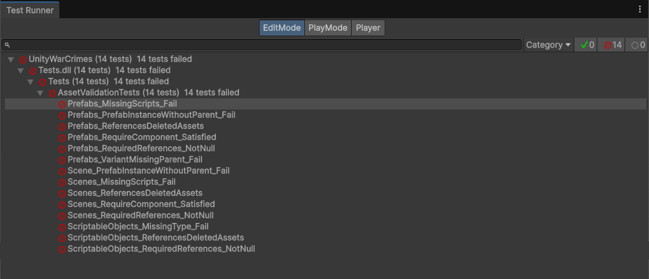
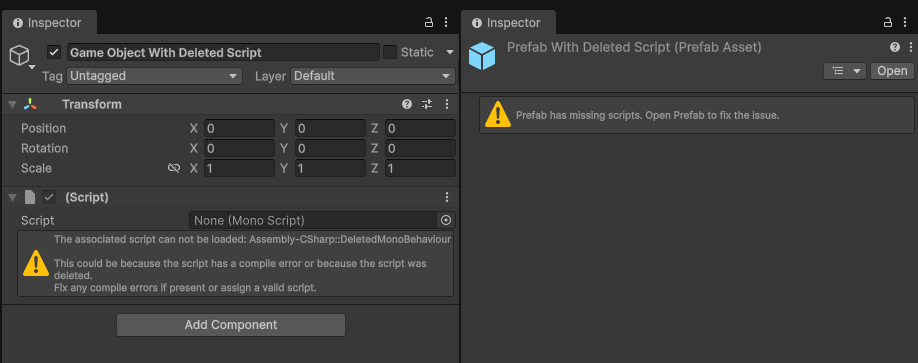
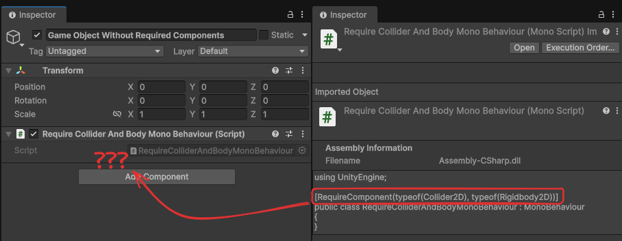
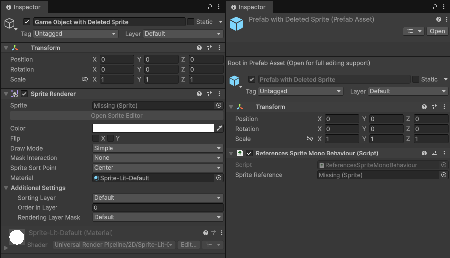
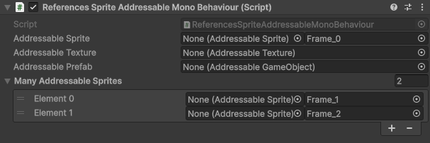
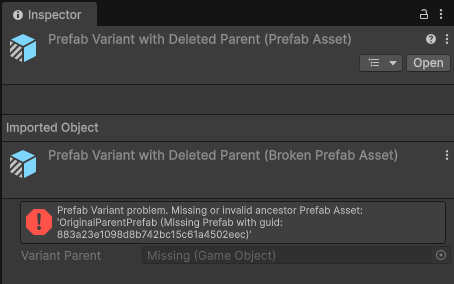
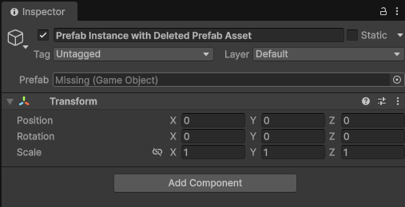
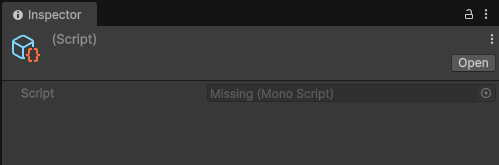

Quick disclaimer: This might not be the "proper" way to write tests according to the rules of Serious Software ™️ testing. This works for me, and if you don't have tests yet, it's gonna work for you.

# Unity Asset Validation Tests

**~~(Unity War Crimes Checker)~~**

As you work on a project, requirements change, assets get deleted, and promises get broken, and when you look back, you not only have a lot of tech debt... you don't even know how much debt you have!

For some reason, Unity doesn't trigger any errors in the editor for some blatantly broken assets and instead leaves your game to crash cryptically during runtime.

These tests focus on detecting broken references (deleted assets) and broken promises (`[Required]` and `[RequireComponent]`)

## Quick recap, what are tests?

Tests are when we write code that our "Test Runner" (in this case, Unity) runs to check if our code behaves like we expect it to.

Unity has two kinds of tests: Editor Mode and Play Mode. Since we are going to use the editor tools to parse the assets and verify that no crimes have occurred, we need to use Editor Mode Tests.

## **How do I get these into my project?**

The `Editor` folder in this repo? Add it to your project. Then check the test runner in `Window>General>Test Runner`.

(If this is your very first time going near the Test package, it is a good idea to follow the [unity docs for tests](https://docs.unity3d.com/6000.3/Documentation/Manual/test-framework/getting-started.html). The docs will explain how to create the assemblies and your first test; however, the `Editor` folder in this repo already has the assemblies and test file.)

## Do I have to run them manually?

You can, but you don't have to!
If you have set up a CI/CD pipeline, you can run your tests there!
The amazing people at [Game.CI have guides](https://game.ci/docs/) on how to get the Test Runner going on Github, Gitlab, and CircleCI.

## Anatomy of these tests

All tests will have at some point a way of saying, "I am sure that this has to be true, and if it's not, that means we failed". This is called an `Assert`.

We are going to parse a lot of assets, and we could `Assert` each one individually. I chose to collect all failures, write myself a nice string for each one, and then `Assert` once at the end. If my failure array is empty, then we didn't fail. If it is NOT empty, we failed, and the contents of the array are a somewhat nice message telling me which assets failed.

## But... What are we testing?

Scenes, Prefabs, and Scriptable Objects.  
Those are the ones that have simple rules of when things are definitely broken without relying on "oh, but we do it like that in my team".

#### How to configure which assets get tested

At the top of the test file, you will find this array

```csharp
private static readonly string[] FoldersToScan = new[]  
{  
    "Assets"  
};
```

Since `Assets` is the root folder for all the assets in your project, this means "Analyze Everything". However, you might have an `Assets/Plugins` folder that usually contains third party content that you probably shouldn't test.

It is a good practice to encapsulate your game's assets in a single folder inside `Assets` with your game name. 

In that case, your array would look like this

```csharp
private static readonly string[] FoldersToScan = new[]  
{  
    "Assets/MyCoolGame"  
};

```

(Many people prefix their folder with `__` in an effort to keep it on top. e.g. `Assets/__MyCoolGame`)

However, if you prefer to keep everything in the root, you can add the individual paths to the array like this

```csharp
private static readonly string[] FoldersToScan = new[]  
{  
    "Assets/Prefabs",
    "Assets/Scenes",
    "Assets/Scriptables",
};

```

#### Quick reference table of tests

| Test                                     | Scene | Prefab | Scriptable Object |
| ---------------------------------------- |:-----:|:------:|:-----------------:|
| Deleted C# Script ("Missing Component")  |  ✅   |   ✅   |        ❌         |
| `[Required]` references                  |  ✅   |   ✅   |        ✅         |
| `[RequireComponent]` MonoBehaviours      |  ✅   |   ✅   |        ❌         |
| References to deleted assets             |  ✅   |   ✅   |        ✅         |
| References to deleted Addressable assets |  ✅   |   ✅   |        ✅         |
| Prefab Variant with deleted base prefab  |  ❌   |   ✅   |        ❌         |
| Prefab Instance with deleted base prefab |  ✅   |   ✅   |        ❌         |
| Scriptable Object with deleted C# script |  ❌   |   ❌   |        ✅         |

Some checks are _shared_ between asset types, but since we can't use the _exact_ same code, I split them into different functions in the script.

### Deleted C# Script
`Scenes_MissingScripts_Fail` + `Prefabs_MissingScripts_Fail`

If the C# script file of a MonoBehaviour gets deleted, the GameObjects that had that Component now have a "Missing Script" element.



### `[Required]` references

`Scenes_RequiredReferences_NotNull` + `Prefabs_RequiredReferences_NotNull` + `ScriptableObjects_RequiredReferences_NotNull`

Ok, this one cheats a bit. The `[Required]` FieldAttribute doesn't come with Unity out of the box, but you can simply get it from [NaughtyAttributes](https://github.com/dbrizov/NaughtyAttributes) (Free), [Alchemy](https://github.com/annulusgames/Alchemy) (Free) or Odin Inspector (definitely not free) or you can make your own. This test doesn't need to know or care where the attribute came from since it looks for a field attribute called "Required".


_(left: Naughty Attributes | right: Odin Inspector)_

### `[RequireComponent]` MonoBehaviours
`Scenes_RequireComponent_Satisfied` + `Prefabs_RequireComponent_Satisfied`

Unity does come with a ClassAttribute called `[RequireComponent]` and it lets you specify which other components a game object must have in order to have your MonoBehaviour. It is pretty hard to get a GameObject to have a component while not fulfilling the `RequireComponent` contract; the editor will not allow you to do it. However, if somehow you manage to do it, the editor won't even tell you that the GameObject is now breaking the rules!



### References deleted assets
`Scenes_ReferencesDeletedAssets` + `Prefabs_ReferencesDeletedAssets` + `ScriptableObjects_ReferencesDeletedAssets`

When you reference an asset in a SerializedField, Unity saves a "link" to that asset. If you then delete the asset, the link now points to a deleted asset. The editor shows this as `Missing (Asset)`. While sometimes having a `null` value in a serialized reference is okay (The editor will show it as `None`), pointing to a deleted asset is a sign that something broke.



### References to deleted Addressable assets
`Scenes_ReferencesDeletedAddressableAssets` + `Prefabs_ReferencesDeletedAddressableAssets` + `ScriptableObjects_ReferencesDeletedAddressableAssets`

(Only if you are using the Addressable package. If you are not, you will not see them in the test list.)

A bit of an experimental one, similarly to regular assets, you can use an `AssetReference` from the `Addressables` package to hold an asset without loading it into memory.

The sneaky part is that when deleted, you don't even get a "Missing," in the editor. It just says "None" but the YAML inside retains the UUID of the dead asset!



### Prefab Variant with deleted base prefab
`Prefabs_VariantMissingParent_Fail`

A Prefab Variant is a special kind of prefab designed to inherit the properties of a "base prefab" and override / modify some of its properties.
However, if that base gets deleted, the variant becomes a very broken asset, sometimes not even recognized as a prefab at all by the editor.



### Prefab Instance with deleted base prefab
`Scene_PrefabInstanceWithoutParent_Fail` + `Prefabs_PrefabInstanceWithoutParent_Fail`

A Prefab Instance is when you drag a prefab into a hierarchy. You get a new GameObject that knows that it came from a prefab and can override some of its base properties.
However, if the base gets deleted, the GameObject retains some of the structure of the base prefab but lacks the connection, resulting in inconsistent behaviours.



### Scriptable Object with deleted C# script
`ScriptableObjects_MissingType_Fail`

A ScriptableObject is an asset type defined by a C# script designed to hold data for your project. 
If you delete the script that defined the properties of the scriptable object, the asset becomes an enigma for the engine since it has no description of what data it holds.

